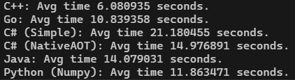

# Prime Sieve Benchmark

| **Component** | **Specification**        |
|---------------|--------------------------|
| **CPU**       | Intel Core i5-1235U      |
| **RAM**       | 16GB                     |



## Description

This project is a benchmark for measuring the performance of different prime number finding algorithms. It includes several implementations of the "Sieve of Eratosthenes" algorithm in different programming languages such as C++, Go, C#, Java, and Python. The benchmark runs each implementation multiple times to obtain the average execution time for each, allowing a comparison of performance.

### Supported Languages:

1. **C++**: Implementation with `clang++` compiler optimizations.
2. **Go**: Standard implementation in Go.
3. **C#**: Implementation in .NET, with both standard and Native AOT (Ahead-Of-Time) compilation options.
4. **Java**: Implementation with JDK.
5. **Python**: Two versions — one using the `Numpy` library, and the other with pure Python for comparison.

## Setup

Currently, this benchmark is designed and tested for **Windows**. To run the benchmark, you'll need the following tools and dependencies:

1. **clang++** for compiling C++ code.
2. **Go** for compiling and running Go code.
3. **.NET SDK** for compiling and running C# code.
4. **JDK** for compiling and running Java code.
5. **Python** and the required libraries for Python (such as `numpy`).

### Install Dependencies

1. **clang++:**  
   Download and install [LLVM](https://llvm.org/) to compile the C++ code.

2. **Go:**  
   Download and install [Go](https://golang.org/dl/).

3. **.NET SDK:**  
   Download and install [.NET SDK](https://dotnet.microsoft.com/download).

4. **JDK (Java):**  
   Install the [JDK](https://www.oracle.com/java/technologies/javase-downloads.html) to compile Java code.

5. **Python (and libraries):**  
   Download and install [Python](https://www.python.org/downloads/). For the Python implementations, install the required libraries:

   ```bash
   pip install numpy
